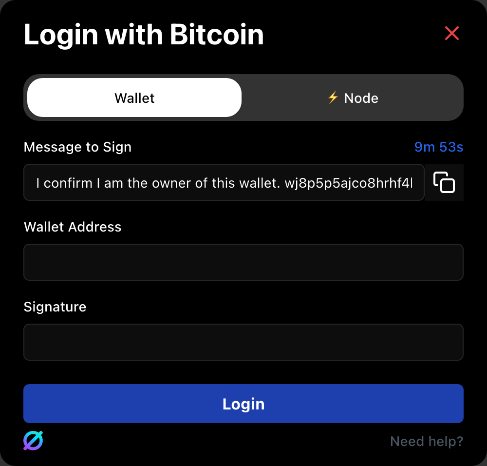
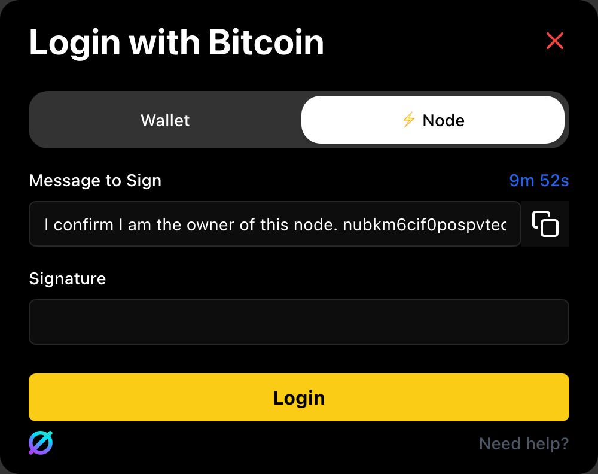

# 🆔 NullPass

## Login Flow

Users can use a Bitcoin wallet address or a Lightning Node to login.&#x20;

### 📃 Wallet


Login is achieved by verifying a signature against a wallet address.


Copy the generated message into your wallet. We will use BlueWallet as an example.

### ⚡ Lightning Node


Login is achieved by extracting the public key from a signature and checking for a node heartbeat.

